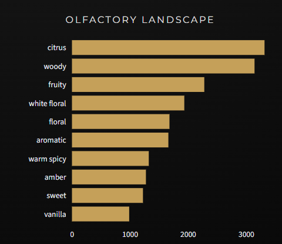
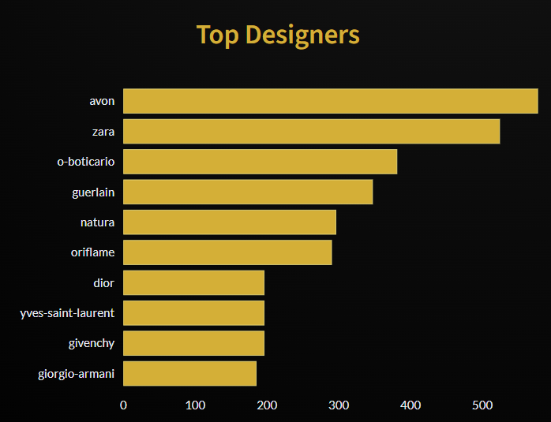

# ✨ ScentSational | Atelier
### The Dark Luxury Fragrance Intelligence Platform

   
  <i>"Scent is the brother of breath."</i>
   

---

## 💎 Project Overview

**ScentSational** is not just a database, it is a digital concierge designed for the modern connoisseur. Moving away from cluttered interfaces, this project implements a **"Dark Luxury" design system** to provide a seamless, high-end user experience for discovering fragrances.

The platform solves the "paradox of choice" in the perfume market by aggregating data, standardizing olfactory notes, and offering curated discovery modes in a mobile-responsive environment.

---
## 🏗️ Architecture & Ecosystem

This project utilizes a **Decoupled Architecture** strategy to optimize performance and resource management. The system is split into two distinct repositories:

### 1. The Atelier (Lite Version) - *Current Repository*
* **Role:** Frontend, Analytics Dashboard, Rule-based Recommendation.
* **Focus:** Speed, Mobile Responsiveness, Data Visualization.
* **Hosting:** Streamlit Cloud.
* **Data:** Lightweight CSV datasets.

### 2. The AI Core (Heavy Version)
* **Role:** Deep Learning Engine, Neural Network Embeddings.
* **Focus:** Chemical similarity search, Advanced NLP.
* **Hosting:** Hugging Face Spaces (GPU/LFS support).
* **Repository:** [📂 ScentSational-Fragrantica-LFS](https://github.com/MagdalenaRomaniecka/ScentSational-Fragrantica-LFS)
* **Live AI Model:** [🤗 Launch AI Core on Hugging Face](https://huggingface.co/spaces/MagdalenaRomaniecka/ScentSational-Fragrantica-LFS)

> *Note: This repository (Lite) links to the AI Core via the application interface, keeping the user experience seamless while managing heavy computational loads externally.*

---

## 🚀 Key Features

* **📱 Mobile-First Design:** A fully responsive interface where layouts (columns, images, typography) adapt fluidly between Desktop and Mobile devices.
* **🔍 Smart Discovery Engine:** Advanced filtering logic that allows users to search by Brand, Name, or Olfactory profile using fuzzy matching.
* **📊 Market Intelligence:** Interactive dashboards powered by Plotly to visualize trends in the fragrance industry.
* **🛡️ Robust Data Pipeline:** Custom CSV parsing engine capable of handling various delimiters and encoding standards automatically.

---

## 📊 Analytics & Insights

Before deployment, the underlying dataset (`scentsational_data.csv`) underwent rigorous Exploratory Data Analysis (EDA).

### The Olfactory Landscape
We mapped the frequency of primary accords across the database. As shown below, the market is currently dominated by **Citrus, Woody, and Fruity** profiles, indicating a consumer shift towards fresh and grounded scents.

  
  
<i>Figure 1: Distribution of dominant olfactory accords in the curated dataset.</i>

### Top Designer Analysis
Beyond olfactory notes, we analyzed market presence by brand. The dataset highlights a mix of high-volume commercial giants (Avon, Zara) alongside heritage luxury houses (Guerlain, Dior), showcasing the diverse range of the collection.

  
  
<i>Figure 2: Top 10 designers by number of fragrances in the database.</i>

---

## 🛠️ Technology Stack

| Component | Technology | Description |
| :--- | :--- | :--- |
| **Core Logic** | `Python 3.9+` | Backend processing and logic control. |
| **Frontend** | `Streamlit` | Web framework with custom CSS injection for "Dark Mode". |
| **Data Eng** | `Pandas` | Data cleaning, regex standardization, and manipulation. |
| **Viz** | `Plotly` | Interactive charts without static modebars. |
| **Deployment** | `Streamlit Cloud` | CI/CD pipeline integrated with GitHub. |

---

## 📂 Project Structure

    ScentSational/
    ├── assets/                  # Static assets (Charts, Images)
    │   └── olfactory_landscape.png
    ├── app.py                   # Main Application (Atelier Dashboard)
    ├── scentsational_data.csv   # Processed Dataset (Source of Truth)
    ├── requirements.txt         # Dependency Management
    └── README.md                # Documentation

 

---

## ⚖️ Data Source & Licensing

### 📚 Data Origin
The application is powered by a curated dataset (`scentsational_data.csv`), rigorously processed for this portfolio.
* **Source:** [Fragrantica Fragrance Dataset (Kaggle)](https://www.kaggle.com/datasets/olgagmiufana1/fragrantica-com-fragrance-dataset)
* **Aggregated Sources:** Consolidated olfactory notes, popularity ratings, and visual assets from public fragrance databases.
* **Preprocessing:** Raw data underwent regex standardization to ensure consistency in brand names and accords.

### 📜 License
This project is released under the **MIT License**.
> *Permission is hereby granted, free of charge, to any person obtaining a copy of this software...*

You are free to use, modify, and distribute this software, provided that the copyright notice is preserved. See the [LICENSE](./) file for details.

---

## 👩‍💻 Author

---

Created by **Magdalena Romaniecka** *Data Analyst & Web Analytics Enthusiast* © 2025

 

