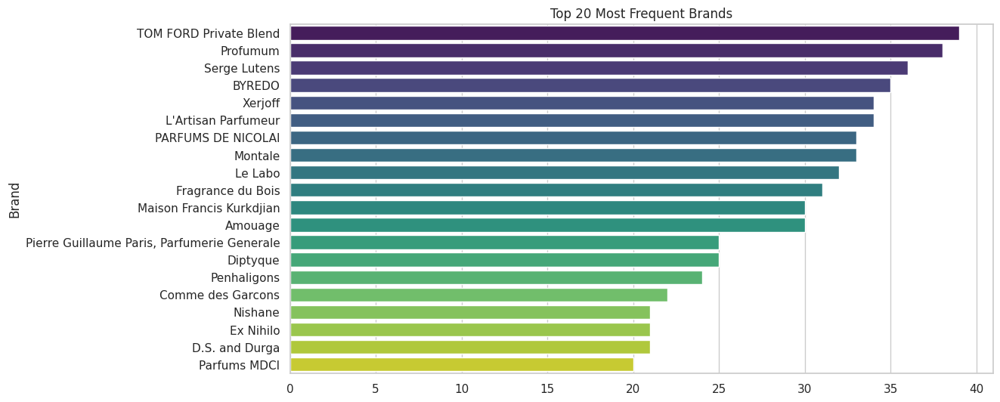
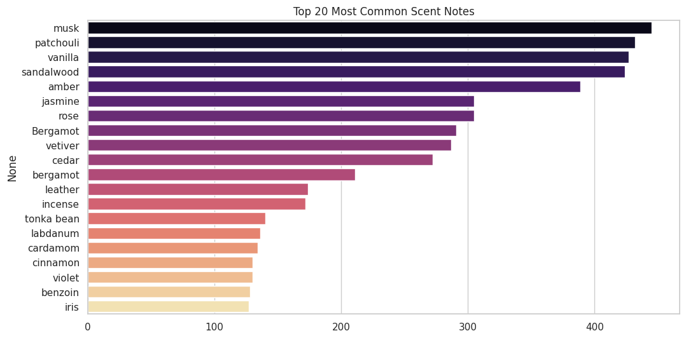
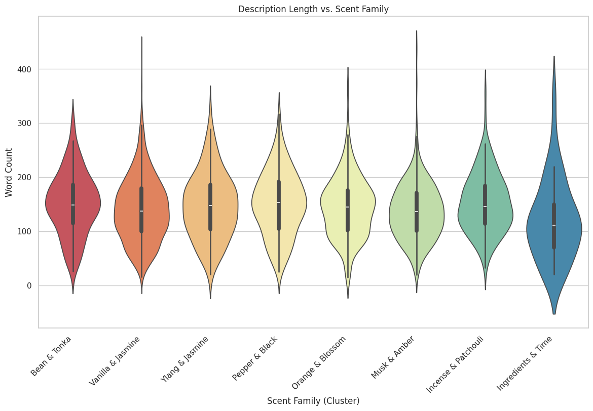
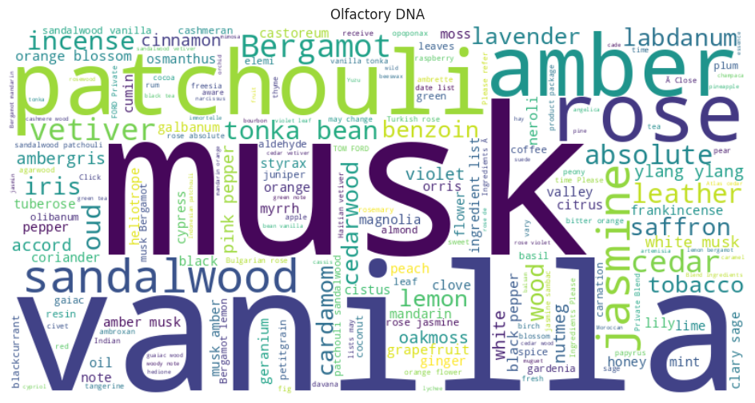

# ✨ ScentSational: AI Perfume Recommender & Market Analysis

[](https://scentsational-evywcwtgnrevjgm4ubxappy.streamlit.app/)
[](https://colab.research.google.com/github/MagdalenaRomaniecka/ScentSational/blob/main/perfume_analysis.ipynb)

> An AI-powered perfume recommendation system that blends chemical note analysis (TF-IDF) with semantic understanding of fragrance descriptions (SBERT) to find your perfect scent match. Includes market segmentation via K-Means clustering.

This repository contains the complete process for building a hybrid content-based recommendation system, from raw data exploration to a deployed interactive web application.

---

## 🖥️ Live Application

This project is deployed as an interactive web app using Streamlit. You can select any perfume from the dataset, and the hybrid AI model will instantly recommend 10 similar scents.

[**🚀 Click here to try the live demo!**](https://scentsational-evywcwtgnrevjgm4ubxappy.streamlit.app/)

---

## 🚀 Quick Start (Run Locally)

1.  **Clone the repo:**
    ```bash
    git clone [https://github.com/MagdalenaRomaniecka/ScentSational.git](https://github.com/MagdalenaRomaniecka/ScentSational.git)
    cd ScentSational
    ```

2.  **Install dependencies:**
    ```bash
    pip install -r requirements.txt
    ```

3.  **Run the Streamlit app:**
    ```bash
    streamlit run app.py
    ```

---

## 🧠 How It Works: The AI Model

This system is a **hybrid model** that combines two NLP techniques to understand both the *ingredients* and the *feeling* of a perfume:

1.  **Ingredient Matching (TF-IDF):** A classic `TfidfVectorizer` analyzes the raw scent notes (e.g., "Vanilla," "Rose," "Sandalwood"). This is great for finding literal matches.
2.  **Semantic Matching (SBERT):** A `Sentence-BERT` transformer model (`all-MiniLM-L6-v2`) converts the *marketing descriptions* (e.g., "a warm, sensual scent for a winter evening") into numerical vectors. This captures the "vibe" and context.

The similarity scores from both models are combined to create a final, robust recommendation.

---

## 📈 Project Insights

Beyond the recommender, the analysis notebook (`perfume_analysis.ipynb`) includes a deep dive into the market. The analysis revealed key insights into brand dominance, common ingredients, and marketing strategies.

* **Market Leader Analysis:** A frequency analysis revealed the most dominant niche brands in the dataset, with **Tom Ford Private Blend, Profumum, and Serge Lutens** leading the pack.
* **Dominant Notes:** A WordCloud and frequency plot both confirmed that **Musk, Rose, and Vanilla** are the most common scent notes, forming the backbone of the collection.
* **Cluster Characteristics:** Analysis of the 8 K-Means "Scent Families" showed that while distinct in their scent profiles, they share a very similar distribution in **marketing description length**, with most descriptions peaking around 150-175 words.

### Visualizations


<br>

<br>

<br>


---

## 🛠️ Tech Stack

| Category | Technologies |
| :--- | :--- |
| **Data Analysis & ML** |    |
| **NLP & Deep Learning** |  *(SBERT)* |
| **Data Visualization** |    |
| **Web Application** |  |
| **Core Stack** |   |

---

## 📂 Repository Structure

| File / Folder | Description |
| :--- | :--- |
| `app.py` | The main Streamlit web application script. |
| `perfume_analysis.ipynb` | Jupyter Notebook with all EDA, clustering, and model building. |
| `requirements.txt` | Python libraries required to run the app. |
| `hybrid_similarity.npy` | **(LFS File)** Pre-computed similarity matrix used by the model. |
| `data/` | Contains the cleaned `perfumes_cleaned.csv` dataset. |
| `images/` | Contains all charts and visuals used in this README. |

---
---

## 📊 Data Source

This project was made possible by the "Perfume Dataset with Notes, Descriptions, and User Ratings" available on Kaggle.

* **Author:** [Anas Ghrab](https://www.kaggle.com/anaghrab)
* **Dataset:** [View on Kaggle](https://www.kaggle.com/datasets/anaghrab/perfume-dataset-with-notes-descriptions-user-ratings)

A sincere thank you to the author for curating and sharing this valuable data.
## 📬 Contact

Created by **[Your Name]** - connect with me on [LinkedIn](https://www.linkedin.com/in/YOUR-PROFILE-URL)!