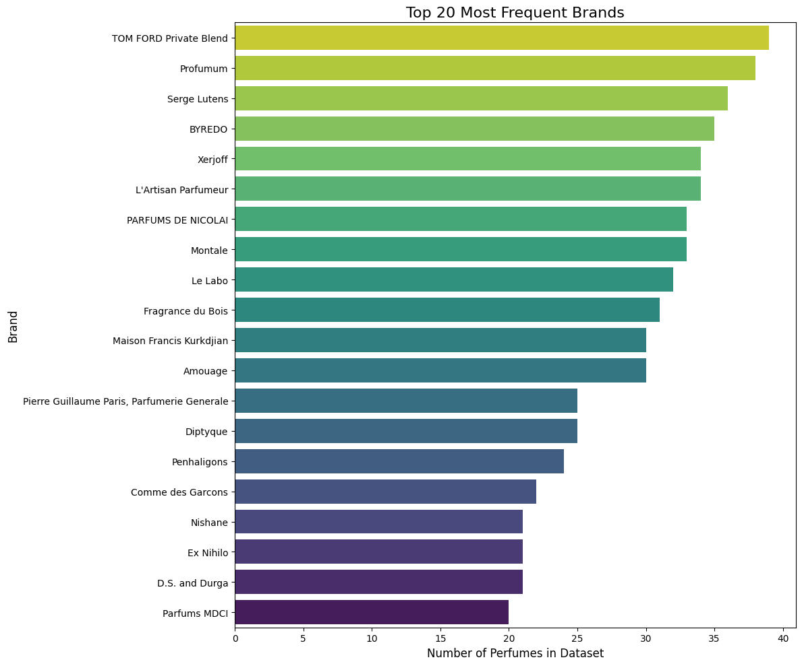
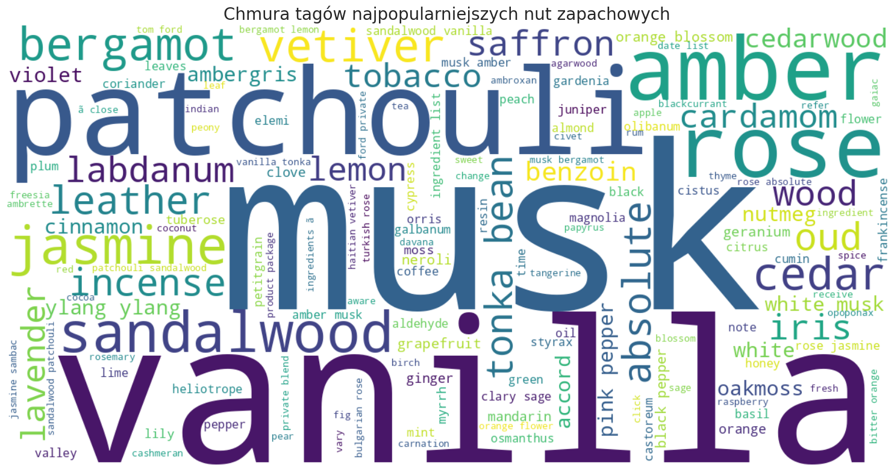
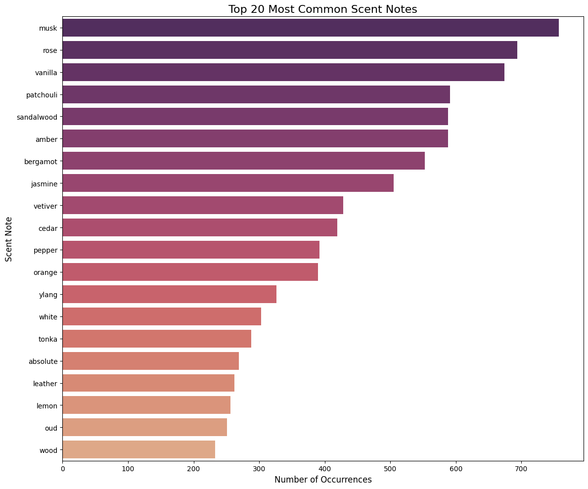
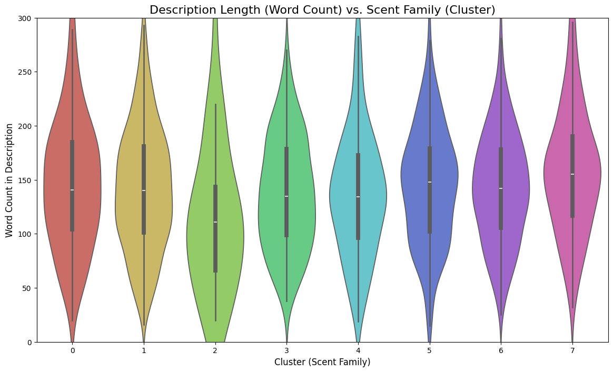

# ✨ ScentSational: AI-Driven Market Research & Recommender

> **"Bridging the gap between chemical composition and olfactory perception using Natural Language Processing."**

[**🚀 Launch AI Concierge**](https://scentsational-evywcwtgnrevjgm4ubxappy.streamlit.app/)
·
[**📓 Read Research Notebook**](https://github.com/MagdalenaRomaniecka/ScentSational/blob/main/perfume_analysis.ipynb)

---

## 🔬 Research Context & Objectives

Finding the perfect fragrance is traditionally a subjective, sensory experience difficult to translate into data. This project aims to **digitize scent** by analyzing the luxury perfume market through two lenses:
1.  **Chemical:** What ingredients (notes) are actually in the bottle?
2.  **Semantic:** How is the perfume described by marketers and consumers?

The goal was to build a **Hybrid Recommendation System** that understands both the "ingredients" and the "vibe" of a scent, solving the cold-start problem of traditional filters.

---

## 📊 Market Analysis (EDA)

Before building the AI model, a comprehensive Exploratory Data Analysis was conducted to understand market trends, brand dominance, and olfactory clusters.

### 1. Market Leaders & Niche Dominance
Analysis of brand frequency reveals a polarized market. While designer brands are popular, niche houses like **Tom Ford Private Blend** and **Serge Lutens** show the highest volume of unique releases, indicating a strategy of hyper-segmentation.

  

### 2. The "Olfactory DNA" of Modern Perfumery
Using text mining on thousands of perfume profiles, we isolated the most frequently used ingredients. The analysis confirms that **Musk, Rose, Vanilla, and Amber** form the foundational backbone of the majority of modern fragrances.

  
  

### 3. Segmentation via K-Means Clustering
Using PCA (Principal Component Analysis) to reduce dimensionality, the dataset was segmented into **8 distinct scent families**. This proves that perfumes naturally cluster based on their description vectors, validating the use of NLP for categorization.

  

> *Full code and interactive charts available in `perfume_analysis.ipynb`.*

---

## 🧠 The AI Engine: Hybrid NLP Model

The recommendation engine is not a simple filter; it is a mathematical distance calculator working in a high-dimensional vector space.

### The Architecture
The model combines two NLP techniques with a weighted average:

| Component | Technology | Function |
| :--- | :--- | :--- |
| **Note Vectorizer** | **TF-IDF** | Analyzes raw ingredients (e.g., *Oud, Bergamot*). It measures the "chemical similarity" between scents. |
| **Description Encoder** | **SBERT (Sentence-BERT)** | Uses a pre-trained Transformer (`all-MiniLM-L6-v2`) to understand the *semantic meaning* of descriptions (e.g., "warm, cozy winter scent"). |

**Final Calculation:**
$$Similarity = (0.6 \times Semantic\_Score) + (0.4 \times Chemical\_Score)$$

---

## 💎 The Application: AI Concierge

The research was deployed as a user-friendly web application using **Streamlit**.

* **Features:**
    * "Quiet Luxury" UI Design (Dark Mode & Gold Accents).
    * Real-time inference using pre-computed Similarity Matrix.
    * Dynamic rendering of perfume monograms.
* **Live Demo:** [ScentSational App](https://scentsational-evywcwtgnrevjgm4ubxappy.streamlit.app/)

---

## 📂 Data Source

This research utilizes the **Perfume Recommendation Dataset** sourced from Kaggle.

* **Dataset:** [Perfume Recommendation Dataset](https://www.kaggle.com/datasets/nandini1999/perfume-recommendation-dataset)
* **Author:** [Nandini](https://www.kaggle.com/nandini1999)
* **Content:** Metadata, notes, ratings, and descriptions for thousands of fragrances.

---

## 🛠️ Tech Stack

* **Analysis:** Python, Pandas, NumPy, Matplotlib, Seaborn.
* **Machine Learning:** Scikit-learn (K-Means, PCA, TF-IDF), Sentence-Transformers (BERT).
* **Engineering:** Streamlit, Git LFS.

---

**Created by Magdalena Romaniecka**
 
*Data Analyst & Researcher*

© 2025

