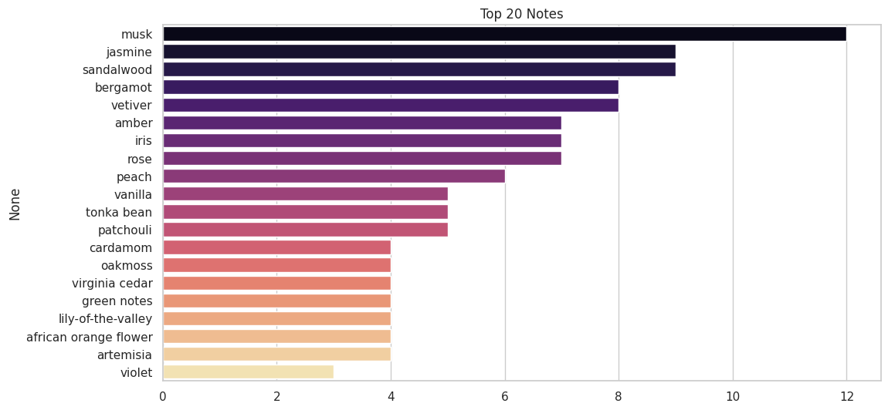
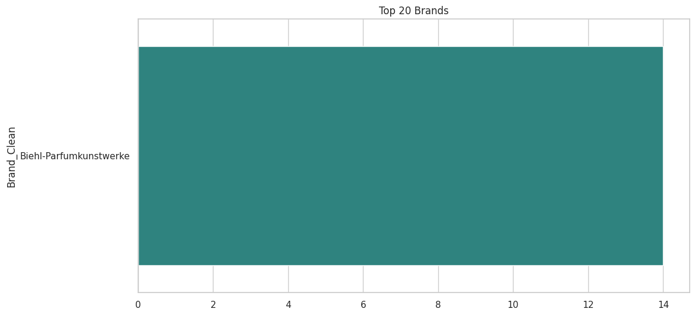

<div align="center">

# ⚜️ SCENTSATIONAL
### The Fragrance Intelligence Platform

> **"Decoding the invisible language of scent through Data Science."**

[](https://scentsational-zbznjhgc4xv7faddappdc2b.streamlit.app/)
[](https://opensource.org/licenses/MIT)
[](https://www.python.org/downloads/release/python-390/)

<br />

**ScentSational** bridges the gap between **Haute Parfumerie** and **Artificial Intelligence**.
It creates a comprehensive ecosystem for analyzing olfactory trends, designer signatures, and chemical DNA.

[Launch Dashboard 🚀](https://scentsational-zbznjhgc4xv7faddappdc2b.streamlit.app/) • [View AI Core 🧪](https://github.com/MagdalenaRomaniecka/ScentSational-Fragrantica-LFS)

</div>

---

## 🧠 The Dual-Engine Architecture

To optimize performance and user experience, the ecosystem is divided into two specialized units:

| **⚜️ THE ATELIER (This Repo)** | **🧪 THE AI CORE (Neural Engine)** |
| :--- | :--- |
| **Role:** Visual Intelligence & Market Analytics | **Role:** Deep Learning & Recommendation System |
| **Tech:** Streamlit, Plotly, Pandas, Regex | **Tech:** SBERT, PyTorch, Vector Embeddings |
| **Focus:** Exploring metadata, analyzing volume trends, and filtering the catalog by brands/notes. | **Focus:** Analyzing the **chemical description** to find perfumes that *smell* similar, ignoring brand marketing. |
| 📍 **[You are here]** | 🔗 **[Go to AI Core](https://github.com/MagdalenaRomaniecka/ScentSational-Fragrantica-LFS)** |

---

## 📊 Market Insights (N=24,000+)

Based on the analysis of over **24,000 olfactory signatures**, ScentSational reveals the hidden patterns of the fragrance industry.

### 1. The Olfactory Landscape
The data confirms clearly defined dominant notes that shape the current market landscape. **Citrus, Woody, and Fruity** accords lead the global preference.

<div align="center">
  
</div>

### 2. Democratization of Volume
While luxury houses like **Dior** maintain prestige, volume analysis indicates a shift towards accessibility. Fast-fashion brands (like Zara) and DTC companies are now key drivers in democratizing niche olfactory profiles.

<div align="center">
  
</div>

---

## 🛠️ Installation & Local Usage

To run the Atelier locally on your machine:

```bash
# 1. Clone the repository
git clone [https://github.com/MagdalenaRomaniecka/ScentSational.git](https://github.com/MagdalenaRomaniecka/ScentSational.git)

# 2. Navigate to the directory
cd ScentSational

# 3. Install requirements
pip install -r requirements.txt

# 4. Launch the Atelier
streamlit run app.py


---

## 📂 Credits & Provenance

### Author & Lead Developer
**Magdalena Romaniecka** *Concept, Architecture, UI Design, and Analytical Implementation.*

### Data Source
The raw dataset is sourced from the open-source community:
* **Dataset:** [Fragrantica.com Fragrance Dataset](https://www.kaggle.com/datasets/olgagmiufana1/fragrantica-com-fragrance-dataset)
* **Original Author:** *olgagmiufana1* (Kaggle)
* *Note: Data has been aggressively cleaned and processed by ScentSational algorithms (Regex/NLP) to ensure high-quality visualization.*

---

## ⚖️ License

This project is licensed under the **MIT License**.
Copyright © 2025 **Magdalena Romaniecka**
